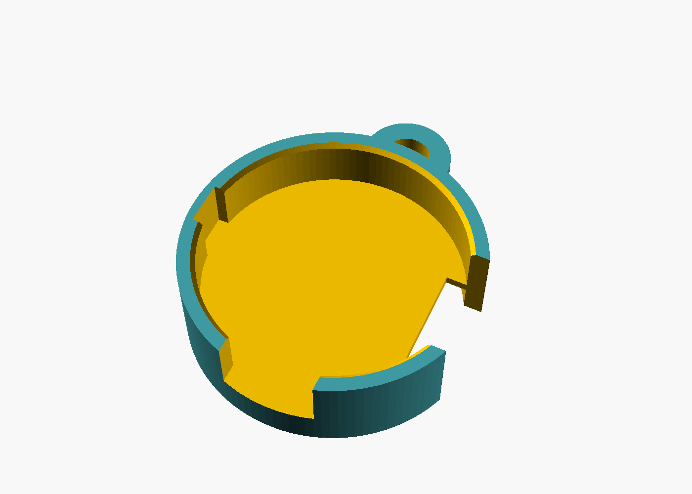

# soundcore Work 录音豆托座

给 Anker soundcore Work（型号 D3200，国内叫「AI 录音豆」）做的 3D 打印托座，OpenSCAD 参数化。

**状态：v0.1。已用 OpenSCAD 2026.09.12 编译通过（流形、无警告、整件一块），还没打印过。** 先打一件当试配件，合不上就改参数重出。

| 正面（豆子从这边按进去） | 背面（磁吸片贴在凹槽里） |
|---|---|
|  |  |

| 文件 | 是什么 |
|---|---|
| `托座.stl` | 按默认参数导出的 3D 模型，直接丢进切片软件或发给打印店。GitHub 上点开能转着看 |
| `托座.scad` | 生成模型的代码，改数字就能改形状 |

外形 Φ27 × 8.4 mm（挂绳环伸出到 20.8），PLA 实心约 1.5 g，打印约 15 分钟。

## 做法

托座的底板当「衣领」用：豆子坐进正面的浅杯，豆子自带的磁吸片贴在底板背面，隔着 0.8 mm 底板吸住。不加磁铁，不加金属件。正面完全敞开，不挡麦克风、指示灯和双击打标。

- 0° 处是绑带槽，整高贯穿，绑带从这里拐到背面
- −90° 处是侧键缺口，顶部敞开
- 180° 处杯壁内侧有一道蜂鸣器出声槽
- 90° 处是挂绳环，孔径 4.5，能同时穿挂绳和保险绳

豆子朝正面方向只靠磁力固定。拿细绳在豆子自带的绑带上打个结，另一头系进挂绳孔，当保险绳。

## 打印

背面朝下，不用支撑，0.2 mm 层高。底板是一段约 24 mm 的搭桥，开着风扇打。

## 打印前先量（9/20 已按实拍照片核过一轮：侧键方向、侧键尺寸、触点位置已确认；磁吸片厚度实拍约 2.3、专利画 1.5，仍要卡尺）

外径 Φ23.34 来自 FCC 公开文件（FCC ID 2AOKB-D3200，SAR 附录 D 第 5 页的线稿）。其余标【估】的尺寸是从线稿和外观设计图上按比例量的，用卡尺核一遍：磁吸片厚度、绑带宽度、侧键宽度和下沿高度。

另外看一眼实物：正面朝你、绑带在 3 点钟方向，侧键在 6 点钟还是 12 点钟。在 12 点钟就把 `btn_angle` 改成 90、`loop_angle` 改成 −90。

| 现象 | 调哪个 |
|---|---|
| 塞不进 / 太晃 | `fit` |
| 吸不住 | 先把 `skirt` 关掉打一个对照件，再调薄 `floor_t` |
| 磁吸片凸出背面 | `plate_t` |

改完参数重新出 STL：

    openscad --export-format binstl -o 托座.stl 托座.scad
